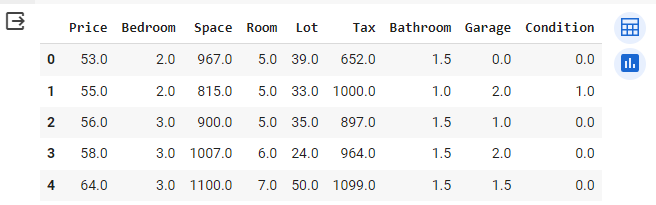
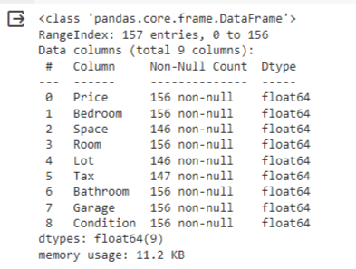
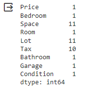
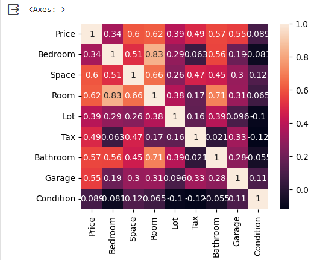
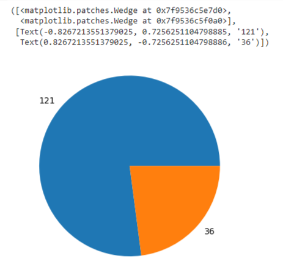
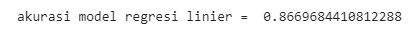

# Proyek Pembelajaran Mesin
#### Nama : Anggun Lisnawati
#### NIM : 211351019
#### Kelas : Malam B
#### Teknik Informatika
---
## Domain Proyek
Aplikasi ini dirancang untuk memberikan informasi mengenai harga rumah di Chicago harga bagi orang yg ingin membeli rumah di Chicago untuk digunakan sebagai tempat pribadi atau tempat berbisnis di bidang properti perumahan. Aplikasi ini dapat memberikan gambaran menyeluruh mengenai kisaran harga rumah yang tersedia di kawasan tersebut.
## Business Understanding
Agar mengetahui detail harga dan spesifikasi yang di ingin kan 
## Problem Statements
- Rumah seperti apa yang di inginkan?
- Apakah kita bisa melihat data spesifikasi rumahnya?
## Goals
- Dari kebanyakan orang kita pasti melihat dari patokan harga dimulai dari harga termurah sehingga kita bisa melihat detail harga yang di inginkan.
- Data spesifikasi rumah yang kita bisa di lihat yaitu dari beberapa ruangan, kamar mandi, garasi, kondisi rumah tersebut, dan lain lain.
## Solution statements
1) Algoritma yang dipakai untuk proyek Pembelajaran Mesin ini adalah Linear Regression.
2) Mengisi data yang kosong (Null)
## Data Understanding
Data yang dipakai adalah data yang berasal dari Kaggle [Chicago House Price](https://www.kaggle.com/datasets/tawfikelmetwally/chicago-house-price/data) 
## Ada pun Variabel-variabel pada Dataset ini adalah sebagai berikut:
- Price : Harga rumah
- Bedroom: Banyaknya Kamar
- Room: Banyaknya Ruangan
- Space : Ukuran Rumah
- Lot : Lebar
- Tax : Pajak (dalam tahunan)
- Bathroom : Banyaknya Kamar mandi
- Garage : Banyaknya garasi
- Condition: Kondisi Rumah (Jika 1 itu bagus , Jika 0 sebaliknya)
##### dtypes: float64(9)
## Data Preparation
Sebelum menggunakan datanya, kita download terlebih dahulu data Kagglenya 
```py
!kaggle datasets download -d tawfikelmetwally/chicago-house-price
```
Setelah itu kita buka data setnya
```py
!mkdir chicago-house-price
!unzip chicago-house-price.zip -d chicago-house-price
!ls chicago-house-price
```
Impor data Pustaka dan datanya dikarenakan menggunakan metode Linear Regression maka kita masukan metodenya.
```py
import pandas as pd
import numpy as np
import matplotlib.pyplot as plt
import seaborn as sns
from sklearn.model_selection import train_test_split
from sklearn.linear_model import LinearRegression
```
Lalu kita akan memangil data setnya
``` py
df = pd.read_csv('/content/chicago-house-price/realest.csv')
```
### Eskplorasi data
Disini Anggun ingin melihat isi data nya terlebih dahulu
``` py
df . head()
```

Setelah di lihat kita langsung cek data typenya.
``` py
df.info()
```


Ternyata seluruh datanya per tipe float64 kita lanjut untuk cek apakah ada data yang kosong?
```py
df.isna().sum()
```


Ternyata ada data yang kosong sehingga kita isi terlebih dahulu
```py
df.fillna(0, inplace=True)
```
Data sudah terisi 
### Visualisasi data
Lalu saya membuat heatmap agar menunjukan korelasi variable numerik.
```py
plt.figure(figsize=(10,8))
sns.heatmap(df.corr(),annot=True)
```


kita akan memvisualisasikan heat map null

```py
sns.heatmap(df.isnull())
```


Selanjutnya kita akan melihat seberapa banyak rumah yang bagus dan sebaliknya menggunakan Pie Chart
```py
plt.pie(df['Condition'].value_counts(),
       labels = df['Condition'].value_counts())
```


Datanya sudah oke.
### Data Preprocessing
Saya tidak menggunakan seleksi fitur dikarena kan tipe data saya float64 sehingga:
```py
X = df.drop('Price', axis='columns')
y = df['Price']
```
x nya itu selain dari pada kolom price dan y nya price
### Modelling
Kita langsung eksekusi dengan melakukan split data test 10% dan randomstate 45%.
```py
X_train, X_test, y_train, y_test = train_test_split(X,y, test_size = 0.1, random_state=45)
```
Proses modelling sendiri kita masukan proses Linear Regression
```py
lr = LinearRegression()
lr.fit(X_train,y_train)
pred = lr.predict(X_test)
```
## Evaluation
Setelah di proses kita tampilkan score dari proses modelling tersebut.
```py
score = lr.score(X_test, y_test)
print('akurasi model regresi linier = ', score))
```


Akurasi yang di dapatkan sebesar 0.8669684410812288 atau sekitar 86%

## Deployment
[.png")(https://chicagohouse-anggun.streamlit.app/))]([https://github.com/](https://chicagohouse-anggun.streamlit.app/)https://chicagohouse-anggun.streamlit.app/)


